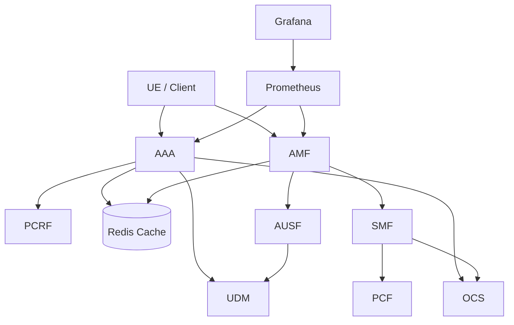
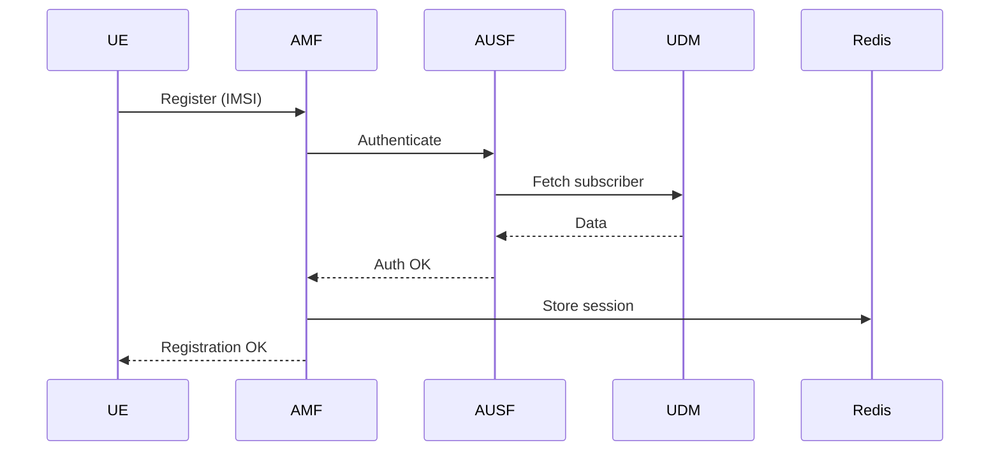
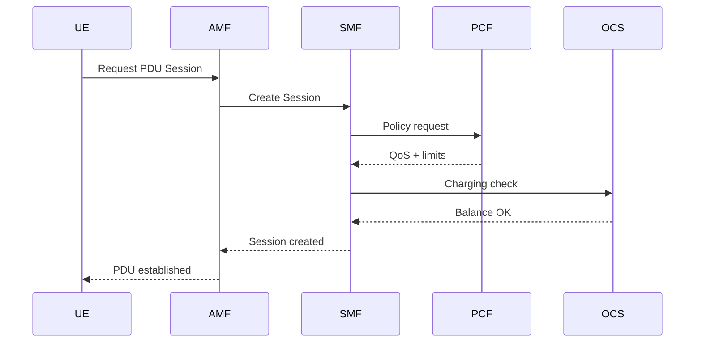

# 📡 Telecom Lab – Cloud-Native 5G Core Simulation


A cloud-native telecom core simulation built with microservices and Kubernetes, demonstrating real-world 4G/5G control-plane concepts including authentication, session orchestration, policy control, charging, and observability.

---

## 🎯 Project Overview

This project simulates a cloud-native telecom core network, demonstrating real-world 4G/5G control-plane workflows such as authentication, session orchestration, policy control, charging, and observability.
It combines:

telecom domain knowledge (AAA, AMF, SMF, policy, charging)
microservices design
Kubernetes orchestration
observability (Prometheus + Grafana)

---

## 🧩 Architecture



## ⚙️ Services

Service	Description
| Service | Description                                                    |
|---------|----------------------------------------------------------------|
|   AAA   | Authentication and orchestration (legacy / 4G-style flow)      |
|   AMF   | 5G Access & Mobility Management (registration + orchestration) |
|   SMF   | Session Management (PDU session handling)                      |
|   AUSF  | Authentication Server Function                                 |
|   UDM   | Subscriber database simulator                                  |
|   PCRF  | Policy control (4G-style)                                      |
|   PCF   | Policy control (5G-style)                                      |
|   OCS   | Online charging system                                         |
|   SMSC  | SMS handling and delivery tracking                             |
|  Redis  | Cache and session storage                                      |

---

## 🔁 Core Flows

1️⃣ UE Registration (5G AMF Flow)



2️⃣ PDU Session Flow



---

## 📊 Observability (Prometheus + Grafana)

The project includes full observability using Prometheus and Grafana.

AMF Metrics
- amf_registrations_total
- amf_pdu_sessions_created_total
- amf_auth_failures_total
- amf_errors_total
- amf_register_requests_total
- amf_pdu_session_requests_total

Dashboard Features
- KPI overview (registrations, sessions, errors)
- Real-time traffic monitoring
- Health indicators (failures, errors)

Example Dashboard
🟢 Healthy system → 0 errors
🔴 Errors/failures → immediate visibility

🔎 AAA Flow (Legacy Control Plane)

Client → AAA → UDM / PCRF / OCS → Redis

- subscriber authentication
- policy assignment
- charging validation
- caching with Redis

## 🧠 Key Features
- Microservice-based telecom architecture
- 4G + 5G hybrid control-plane simulation
- Redis-based session and cache management
- Kubernetes deployments with self-healing
- Prometheus metrics + Grafana dashboards
- Realistic telecom flows (registration + PDU session)

## ❤️ Kubernetes

Each service includes:

- Deployment
- Service
- Health endpoint
- Liveness & Readiness probes

Kubernetes provides:

- self-healing pods
- rolling updates
- service discovery

---

##🛠 Running the Project

```bash
minikube start
eval $(minikube docker-env)
```

Build images:
```bash
docker build -t aaa-service ./aaa-service
docker build -t amf-service ./amf-service
docker build -t smf-service ./smf-service
```

Deploy:
```bash
kubectl apply -R -f kubernetes/
```

📈 Monitoring
```bash
kubectl port-forward -n monitoring svc/monitoring-kube-prometheus-prometheus 9090:9090
```
```bash
kubectl port-forward -n monitoring svc/monitoring-grafana 3000:80
```

Prometheus → http://localhost:9090

Grafana → http://localhost:3000


## 🔮 Future Improvements

- CI/CD pipeline
- distributed tracing
- SMF observability
- traffic generator
- full 5G core expansion (NRF, NSSF…)

---

👨‍💻 Author

Marijan Madunić
