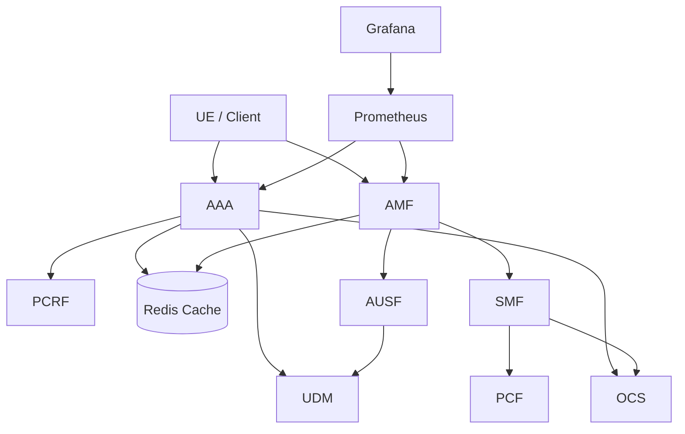
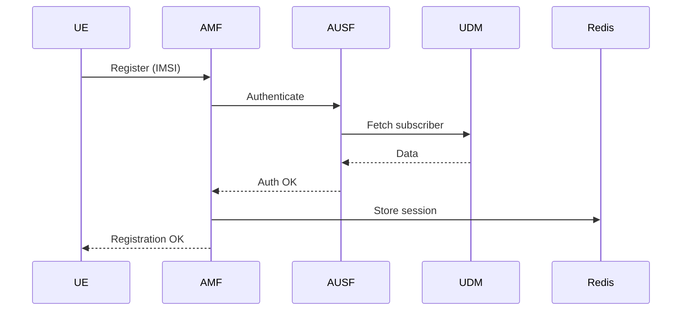
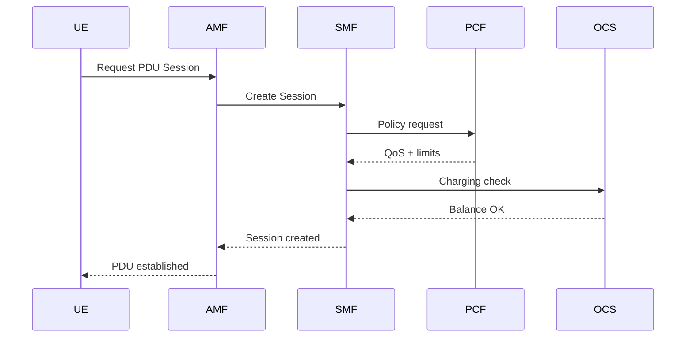

# 📡 Telecom Lab – Cloud-Native 4G/5G Core Simulation


Microservices-based simulation of a telecom core network implemented on Kubernetes, designed to replicate key 4G/5G control-plane workflows including authentication, session management, policy control, charging, and observability.

Built as a cloud-native system with a focus on distributed service interaction, scalability patterns, and operational visibility.

---

## 🧱 Architecture Overview

The system is composed of independent microservices deployed in a Kubernetes cluster:

- **AMF** – Access & Mobility Management  
- **SMF** – Session Management Function  
- **AUSF** – Authentication Function  
- **UDM** – Subscriber Data Management  
- **PCF / PCRF** – Policy Control  
- **OCS** – Online Charging System  
- **AAA** – Legacy authentication flow (4G-style)  
- **SMSC** – Messaging simulation  
- **Redis** – Session/cache layer  

All services communicate over HTTP-based APIs and share state through Redis where applicable.




---

## 🧩 Design Principles

- Microservice isolation per network function  
- Stateless service design where applicable  
- Externalized session/state storage (Redis)  
- Kubernetes-native deployment model  
- Observable system behavior via metrics  

---

## 🔄 Core Flows

### UE Registration (5G-style)

AMF → AUSF → UDM → AMF  
Authentication and subscriber validation flow.


---

### PDU Session Establishment

AMF → SMF → PCF → OCS  
Session creation with policy enforcement and charging validation.



---

### Charging Flow (Legacy AAA path)

Client → AAA → UDM / PCRF / OCS → Redis  
Authentication, policy assignment, and charging validation.

---

## 🧪 Example Scenarios

- UE registration via AMF with authentication through AUSF
- PDU session creation with SMF orchestration
- Policy enforcement via PCF
- Charging validation via OCS
- Redis-based session storage and caching

---

## 📊 Observability

The system exposes metrics via Prometheus and visualizes them in Grafana.

### Key Metrics (AMF example)

- `amf_registrations_total`  
- `amf_pdu_sessions_created_total`  
- `amf_auth_failures_total`  
- `amf_errors_total`  

### Dashboards

- Registration and session rates  
- Failure and error tracking  
- System health overview  
- Real-time service activity  

### Stack

- Prometheus  
- Grafana  

---

## ☸️ Kubernetes Deployment

Each service includes:

- Deployment  
- Service definition  
- Health endpoints  
- Liveness & readiness probes  

Kubernetes provides:

- Self-healing pods  
- Rolling updates  
- Service discovery  
- Horizontal scaling capability  

---

## 🚀 Local Setup

### Start cluster

```bash
minikube start
eval $(minikube docker-env)
```

### Build services
```bash
docker build -t aaa-service ./aaa-service
docker build -t amf-service ./amf-service
docker build -t smf-service ./smf-service
```

### Deploy system
```bash
kubectl apply -R -f kubernetes/
```

## 📈 Monitoring Access
```bash
kubectl port-forward -n monitoring svc/monitoring-kube-prometheus-prometheus 9090:9090
kubectl port-forward -n monitoring svc/monitoring-grafana 3000:80
```

Prometheus → http://localhost:9090

Grafana → http://localhost:3000

---
---

## 🚀 Additional Labs

- [BGP Network Lab](./network-lab) — Container-based eBGP routing simulation using FRRouting and Containerlab, including route exchange validation and end-to-end connectivity testing.

---
---

## 🧠 Key Capabilities Demonstrated

- Distributed system design using microservices
- Kubernetes orchestration patterns
- Network function virtualization concepts (4G/5G core)
- Observability and metrics-driven operations
- Stateful vs stateless service separation
- Failure visibility through monitoring

---

## 🔮 Future Work

- CI/CD pipeline integration
- Distributed tracing (OpenTelemetry)
- Traffic generation framework
- NRF/NSSF extension for full 5G core simulation
- Load testing under Kubernetes scaling scenarios

---

## 👨‍💻 Author

Marijan Madunić
