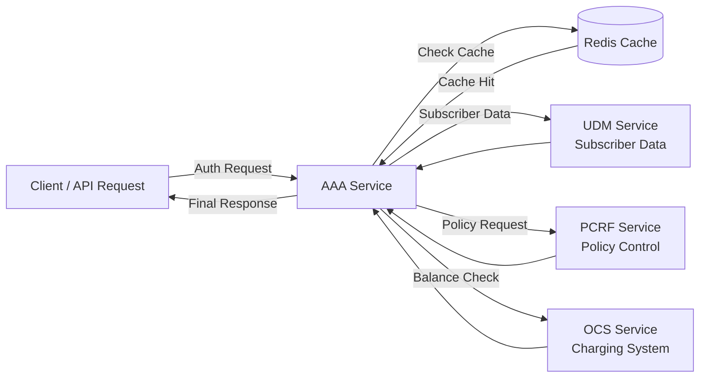

# 📡 Telecom Lab – Mini Telco Core on Kubernetes


A mini telecom core simulation built with Python microservices and Kubernetes.
The project demonstrates core telecom concepts such as subscriber authentication, policy control, charging, caching, and cloud-native deployment.

---

# Project Overview

This lab simulates a simplified telecom core using the following components:

* **AAA** – authentication, orchestration, and roaming logic
* **UDM** – subscriber database simulation
* **PCRF** – policy decision engine
* **OCS** – online charging and balance check
* **Redis** – cache layer for faster responses

The system is implemented as **containerized microservices** deployed on **Kubernetes**.

---

# Project Goals

The goal of this project is to demonstrate:

* microservice-based telecom architecture
* subscriber authentication and orchestration logic
* policy control and charging workflow
* Redis-based caching
* Kubernetes deployment and self-healing behavior

This project is intended as a **learning lab for telecom core concepts and cloud-native infrastructure**.

---

# Architecture

```
Client
  |
  v
AAA Service
  |-- UDM   -> subscriber data (plan, roaming status)
  |-- PCRF  -> policy decision
  |-- OCS   -> balance / charging
  \-- Redis -> cache
```

The **AAA service** acts as the orchestration layer coordinating all other services.

---

## Architecture Diagram



# Services

| Service | Description                                                                            |
| ------- | -------------------------------------------------------------------------------------- |
| AAA     | Main orchestration service for authentication, roaming logic, and response aggregation |
| UDM     | Subscriber data simulator                                                              |
| PCRF    | Policy decision engine                                                                 |
| OCS     | Online charging system for balance checks                                              |
| Redis   | Cache layer used by AAA                                                                |

---

# Technologies Used

* Python
* Flask
* Redis
* Docker
* Kubernetes
* Minikube

---

# AAA Flow

1. The client sends an authentication request:

```
GET /auth/<IMSI>
```

Example:

```
curl http://AAA/auth/001010000000001
```

2. AAA first checks the Redis cache.

3. If the data is not cached, AAA calls:

* **UDM** for subscriber data
* **PCRF** for policy decision
* **OCS** for balance information

4. AAA builds the final response and returns it to the client.

---

# Example Response

```
{
  "auth": "granted",
  "balance": 900,
  "imsi": "001010000000001",
  "is_roaming": false,
  "plan": "gold",
  "policy": "premium",
  "source": "udm"
}
```

---

# Roaming Logic

If a subscriber is roaming, the service plan is downgraded:

* gold → silver
* silver → bronze

After that, **PCRF assigns a policy based on the adjusted plan**.

---

# Cache Behaviour

AAA uses Redis caching with TTL.

Example behaviour:

First request:

```
"source": "udm"
```

Next request:

```
"source": "cache"
```

This reduces service calls and improves response time.

---

# Kubernetes Features

Each microservice includes:

* Deployment
* Service
* Health endpoint
* Liveness probe
* Readiness probe

Kubernetes automatically provides:

* self-healing
* pod restart
* rolling updates
* service discovery

---

# Example Logs

Cache miss scenario:

```
Cache MISS -> calling UDM
Calling PCRF
Calling OCS
```

Cached response:

```
Cache HIT
```

---

# Running the Project

Start Minikube:

```
minikube start
eval $(minikube docker-env)
```

Build Docker images:

```
docker build -t aaa-service .
docker build -t udm-service .
docker build -t pcrf-service .
docker build -t ocs-service .
```

Deploy to Kubernetes:

```
kubectl apply -f kubernetes/
```

---

# Future Improvements

Planned next steps:

* CI/CD pipeline
* traffic simulation
* usage tracking
* throttling
* observability with Prometheus and Grafana
* distributed tracing

---

# Project Purpose

This project demonstrates how **telecom core logic can be implemented using cloud-native microservices running on Kubernetes**.

It serves as a **practical learning lab combining telecom concepts with modern DevOps and cloud technologies**.
