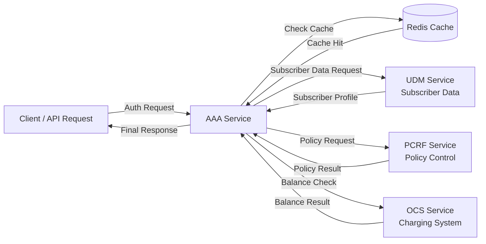

# 📡 Telecom Lab – Mini Telco Core on Kubernetes


A mini telecom core simulation built with Python microservices and Kubernetes.

This project demonstrates a simplified **telecom control plane architecture** implemented using **cloud-native microservices**.

The system simulates typical telecom core components such as **AAA, UDM, PCRF and OCS**, along with caching and orchestration logic.

---

## 🎯 Project Goals

The goal of this project is to demonstrate:

* microservice-based telecom architecture
* subscriber authentication and orchestration logic
* telecom policy control
* charging and balance checking
* Redis-based caching
* Kubernetes deployment
* self-healing infrastructure

This project serves as a **learning lab combining telecom core concepts with modern cloud-native technologies**.

---

## 🧩 Architecture

```text
Client
  |
  v
AAA Service
  |
  |-- UDM   -> subscriber data (plan, roaming status)
  |-- PCRF  -> policy decision
  |-- OCS   -> balance / charging
  \-- Redis -> cache
```

The **AAA service acts as the orchestration layer**, coordinating communication between all services.

---

## 🌐 Architecture Diagram



This diagram represents a simplified telecom control-plane flow where the **AAA service orchestrates authentication, policy control, charging, and caching**.

---

## ⚙️ Services

| Service | Description                                     |
| ------- | ----------------------------------------------- |
| AAA     | Authentication, orchestration and roaming logic |
| UDM     | Subscriber database simulator                   |
| PCRF    | Policy decision engine                          |
| OCS     | Online charging system (balance check)          |
| Redis   | Cache layer used by AAA                         |

---

## 🚀 Technologies

* Python (Flask)
* Redis
* Docker
* Kubernetes
* Minikube

---

## 🔎 AAA Flow

### 1️⃣ Client sends authentication request

```bash
GET /auth/<IMSI>
```

Example:

```bash
curl http://AAA/auth/001010000000001
```

### 2️⃣ AAA checks Redis cache

### 3️⃣ If cache miss

AAA calls the following services:

* **UDM** → subscriber data
* **PCRF** → policy decision
* **OCS** → balance information

### 4️⃣ AAA builds the final response and returns it to the client

---

## 🧪 Example Response

```bash
curl http://AAA/auth/001010000000001
```

```json
{
  "auth": "granted",
  "balance": 900,
  "imsi": "001010000000001",
  "is_roaming": false,
  "plan": "gold",
  "policy": "premium",
  "source": "udm"
}
```

---

## 🌍 Roaming Logic

If a subscriber is roaming, the service plan is downgraded:

```text
gold -> silver
silver -> bronze
```

After the downgrade, **PCRF assigns a policy based on the adjusted plan**.

---

## 🧠 Cache Behaviour

AAA uses **Redis TTL caching**.

Example behaviour:

First request:

```text
"source": "udm"
```

Next request:

```text
"source": "cache"
```

This reduces service calls and improves response time.

---

## ❤️ Kubernetes Features

Each microservice includes:

* Deployment
* Service
* Health endpoint
* Liveness probe
* Readiness probe

Kubernetes automatically provides:

* pod restart
* self-healing
* rolling updates
* service discovery

---

## 📊 Example Logs

Cache miss scenario:

```text
Cache MISS -> calling UDM
Calling PCRF
Calling OCS
```

Cached request:

```text
Cache HIT
```

---

## 🛠 Running the Project

Start Minikube:

```bash
minikube start
eval $(minikube docker-env)
```

Build Docker images:

```bash
docker build -t aaa-service .
docker build -t udm-service .
docker build -t pcrf-service .
docker build -t ocs-service .
```

Deploy to Kubernetes:

```bash
kubectl apply -f kubernetes/
```

---

## 🔮 Future Improvements

Planned next steps:

* CI/CD pipeline
* traffic simulation
* usage tracking
* throttling
* observability with Prometheus and Grafana
* distributed tracing

---

## 📚 Project Purpose

This project demonstrates how **telecom core logic can be implemented as cloud-native microservices running on Kubernetes**.

It serves as a **practical telecom lab combining networking, microservices and cloud-native infrastructure**.

---

## 👨‍💻 Author

Marijan Madunić
