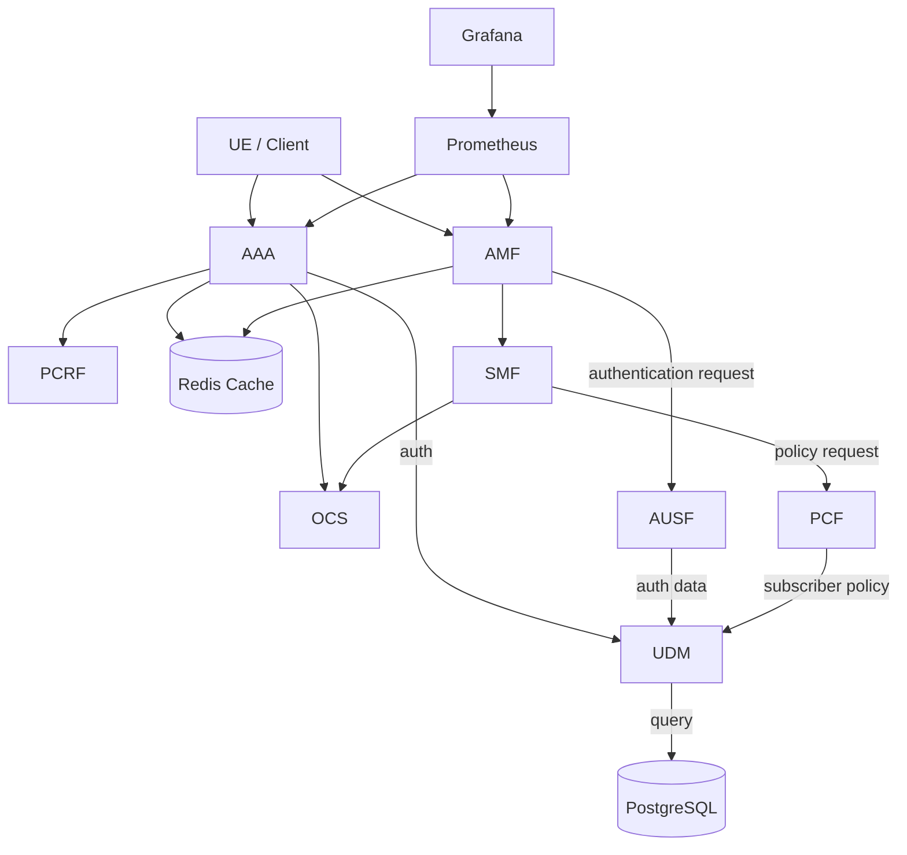
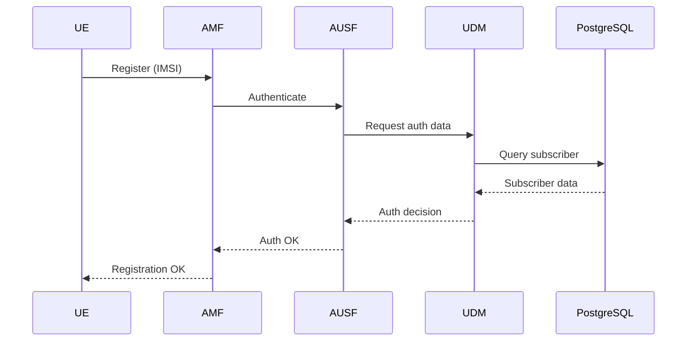
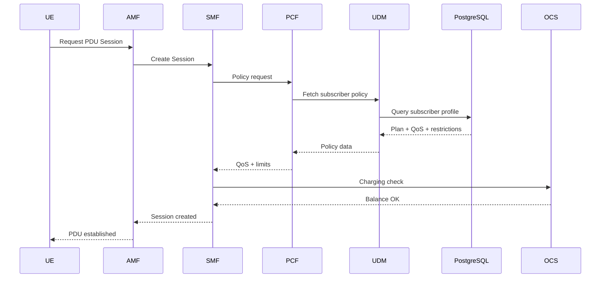
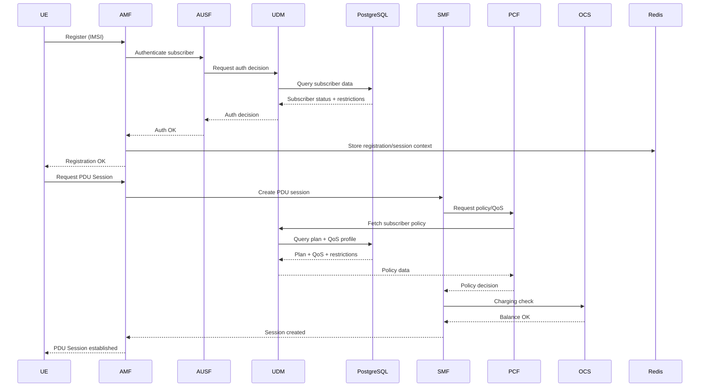

# 📡 Telecom Lab – Cloud-Native 4G/5G Core Simulation


Microservices-based simulation of a telecom core network implemented on Kubernetes, designed to replicate key 4G/5G control-plane workflows including authentication, session management, policy control, charging, and observability.

Built as a cloud-native system with a focus on distributed service interaction, scalability patterns, and operational visibility.

This project evolves from a mock-based simulation into a stateful, data-driven 5G core control-plane using PostgreSQL-backed subscriber management via UDM.

---

## Related Project

- [telecom-lab-RAN](https://github.com/marijan-madunic/telecom-lab-RAN) — C++ RAN simulator running on k3s and communicating with this Core lab remotely.

---

## 🧱 Architecture Overview

The system is composed of independent microservices deployed in a Kubernetes cluster:

- **AMF** – Access & Mobility Management 
- **SMF** – Session Management Function 
- **AUSF** – Authentication Function 
- **UDM** – Subscriber Data Management 
- **PCF / PCRF** – Policy Control 
- **OCS** – Online Charging System 
- **AAA** – Legacy authentication flow (4G-style) 
- **SMSC** – Messaging simulation 
- **Redis** – Session/cache layer 
- **PostgreSQL** – Persistent subscriber and policy datastore (UDM backend)

All services communicate over HTTP-based APIs and share state through Redis where applicable.



```mermaid

graph TD

    UE[UE / Client] --> AAA
    UE --> AMF

    AAA -->|auth| UDM
    AAA --> PCRF
    AAA --> OCS
    AAA --> Redis[(Redis Cache)]

    AMF -->|authentication request| AUSF
    AUSF -->|auth data| UDM

    AMF --> SMF
    SMF -->|policy request| PCF
    PCF -->|subscriber policy| UDM

    UDM -->|query| DB[(PostgreSQL)]

    SMF --> OCS
    AMF --> Redis

    Prometheus --> AMF
    Prometheus --> AAA
    Grafana --> Prometheus

```

---

## Cloud-Native Deployment Architecture

The project initially started on Minikube for fast local Kubernetes development and rapid service iteration.

It has since been migrated to a lightweight k3s-based Kubernetes environment to provide a more realistic cloud-native telecom deployment model with:
- separated RAN and Core workloads
- lightweight multi-node Kubernetes architecture
- scalable microservice deployment
- improved operational realism
- future multi-node expansion capability

### Current architecture direction:

```text
VM1 - telecom-lab-RAN
└── k3s agent node
    └── C++ RAN simulator

VM2 - telecom-lab-Core
└── k3s control-plane node
    ├── AAA
    ├── AUSF
    ├── AMF
    ├── SMF
    ├── UDM
    ├── PCRF / PCF
    ├── OCS
    ├── SMSC
    ├── Redis
    └── HAProxy

Future VM3
└── Observability node
    ├── Prometheus
    ├── Grafana
    └── Alertmanager
```

The project initially started on Minikube for fast local Kubernetes development and was later migrated to k3s to provide a more realistic lightweight cloud-native telecom deployment model with:
- separated RAN and Core workloads
- lightweight multi-node Kubernetes architecture
- scalable microservice deployment
- Kubernetes-native service orchestration
- future multi-node expansion capability

---

## 🧩 Design Principles

- Microservice isolation per network function 
- Stateless service design where applicable 
- Externalized session/state storage (Redis) 
- Kubernetes-native deployment model 
- Observable system behavior via metrics 

---

## 🗄️  Data Layer

The system now includes a persistent data layer powered by PostgreSQL.

    UDM is backed by PostgreSQL and acts as the single source of truth for:
        Subscriber identities (IMSI/MSISDN)
        Subscription plans and QoS profiles
        Access restrictions and roaming configuration

    Other control-plane functions (AUSF, PCF) consume subscriber data via UDM APIs,
    following a service-oriented 5G architecture approach.

This eliminates hardcoded data and enables realistic stateful behavior across the system.

This follows the 5G architecture principle where UDM acts as the centralized subscriber data repository accessed by other control-plane functions.

---

## 🔄 Core Flows

### UE Registration (5G-style)

AMF → AUSF → UDM → PostgreSQL → UDM → AMF
Authentication and subscriber validation flow using persistent subscriber data.

UDM acts as the single source of truth for subscriber data, backed by PostgreSQL.


```mermaid
sequenceDiagram

    participant UE
    participant AMF
    participant AUSF
    participant UDM
    participant DB as PostgreSQL

    UE->>AMF: Register (IMSI)
    AMF->>AUSF: Authenticate
    AUSF->>UDM: Request auth data
    UDM->>DB: Query subscriber
    DB-->>UDM: Subscriber data
    UDM-->>AUSF: Auth decision
    AUSF-->>AMF: Auth OK

    AMF-->>UE: Registration OK
```

---

### PDU Session Establishment

AMF → SMF → PCF → UDM → PostgreSQL → PCF → SMF 
Session creation with policy enforcement based on subscriber data.

PCF retrieves policy decisions from UDM instead of using static logic, enabling dynamic policy enforcement.


```mermaid
sequenceDiagram

    participant UE
    participant AMF
    participant SMF
    participant PCF
    participant UDM
    participant DB as PostgreSQL
    participant OCS

    UE->>AMF: Request PDU Session
    AMF->>SMF: Create Session

    SMF->>PCF: Policy request
    PCF->>UDM: Fetch subscriber policy
    UDM->>DB: Query subscriber profile
    DB-->>UDM: Plan + QoS + restrictions
    UDM-->>PCF: Policy data
    PCF-->>SMF: QoS + limits

    SMF->>OCS: Charging check
    OCS-->>SMF: Balance OK

    SMF-->>AMF: Session created
    AMF-->>UE: PDU established
```

---

### End-to-End 5G Control-Plane Flow

UE → AMF → AUSF → UDM → PostgreSQL 
UE → AMF → SMF → PCF → UDM → PostgreSQL 

This diagram shows the combined authentication and policy-control path using UDM as the central subscriber data provider.


```mermaid
sequenceDiagram

    participant UE
    participant AMF
    participant AUSF
    participant UDM
    participant DB as PostgreSQL
    participant SMF
    participant PCF
    participant OCS
    participant Redis

    UE->>AMF: Register (IMSI)
    AMF->>AUSF: Authenticate subscriber
    AUSF->>UDM: Request auth decision
    UDM->>DB: Query subscriber data
    DB-->>UDM: Subscriber status + restrictions
    UDM-->>AUSF: Auth decision
    AUSF-->>AMF: Auth OK

    AMF->>Redis: Store registration/session context
    AMF-->>UE: Registration OK

    UE->>AMF: Request PDU Session
    AMF->>SMF: Create PDU session
    SMF->>PCF: Request policy/QoS
    PCF->>UDM: Fetch subscriber policy
    UDM->>DB: Query plan + QoS profile
    DB-->>UDM: Plan + QoS + restrictions
    UDM-->>PCF: Policy data
    PCF-->>SMF: Policy decision

    SMF->>OCS: Charging check
    OCS-->>SMF: Balance OK

    SMF-->>AMF: Session created
    AMF-->>UE: PDU Session established
```

---

### Charging Flow (Legacy AAA path)

Client → AAA → UDM / PCRF / OCS → Redis 
Authentication, policy assignment, and charging validation.

---

## Example Scenarios

- UE registration via AMF with authentication through AUSF
- PDU session creation with SMF orchestration
- Policy enforcement via PCF
- Charging validation via OCS
- Redis-based session storage and caching
- Subscriber authentication via AUSF using UDM-backed PostgreSQL data
- Policy decisions via PCF based on real subscriber profiles from UDM

---

## 📊 Observability

The system exposes metrics via Prometheus and visualizes them in Grafana.

### Key Metrics (AMF example)

- `amf_registrations_total` 
- `amf_pdu_sessions_created_total` 
- `amf_auth_failures_total` 
- `amf_errors_total` 

### Dashboards

- Registration and session rates
- Failure and error tracking
- System health overview
- Real-time service activity

### Stack

- Prometheus
- Grafana

---

## Kubernetes Deployment

Each service includes:

- Deployment
- Service definition
- Health endpoints
- Liveness & readiness probes

Kubernetes provides:

- Self-healing pods
- Rolling updates
- Service discovery
- Horizontal scaling capability

---

## 🚀 Local Setup

### Start cluster

## Kubernetes Environment

Current platform:
- k3s (primary deployment platform)

Legacy development platform:
- Minikube

### Build services
```bash
docker build -t aaa-service ./aaa-service
docker build -t amf-service ./amf-service
docker build -t smf-service ./smf-service
```

### Deploy system
```bash
kubectl apply -R -f kubernetes/
```

## 📈 Monitoring Access
```bash
kubectl port-forward -n monitoring svc/monitoring-kube-prometheus-prometheus 9090:9090
kubectl port-forward -n monitoring svc/monitoring-grafana 3000:80
```

Prometheus → http://localhost:9090

Grafana → http://localhost:3000

---
---

## 🚀 Additional Labs

- [BGP Network Lab](./network-lab) — Container-based eBGP routing simulation using FRRouting and Containerlab, including route exchange validation and end-to-end connectivity testing.

---
---

## 🧠 Key Capabilities Demonstrated

- Distributed system design using microservices
- Kubernetes orchestration patterns
- Network function virtualization concepts (4G/5G core)
- Observability and metrics-driven operations
- Stateful vs stateless service separation
- Failure visibility through monitoring
- Integration of PostgreSQL as persistent datastore for telecom control-plane data
- Centralized subscriber data model via UDM (source of truth pattern)
- Service-to-service communication (AUSF/PCF → UDM)
- Implementation of 5G-like control-plane interactions (AUSF/PCF/UDM) with centralized data model

---

## 🔗 Current Control-Plane Data Flow

AUSF → UDM → PostgreSQL 
PCF  → UDM → PostgreSQL 

UDM acts as the central data provider for subscriber and policy information across the system.

---

## 🔮 Future Work

- CI/CD pipeline integration
- Distributed tracing (OpenTelemetry)
- Traffic generation framework
- NRF/NSSF extension for full 5G core simulation
- Load testing under Kubernetes scaling scenarios

---

## 👨‍💻 Author

Marijan Madunić
